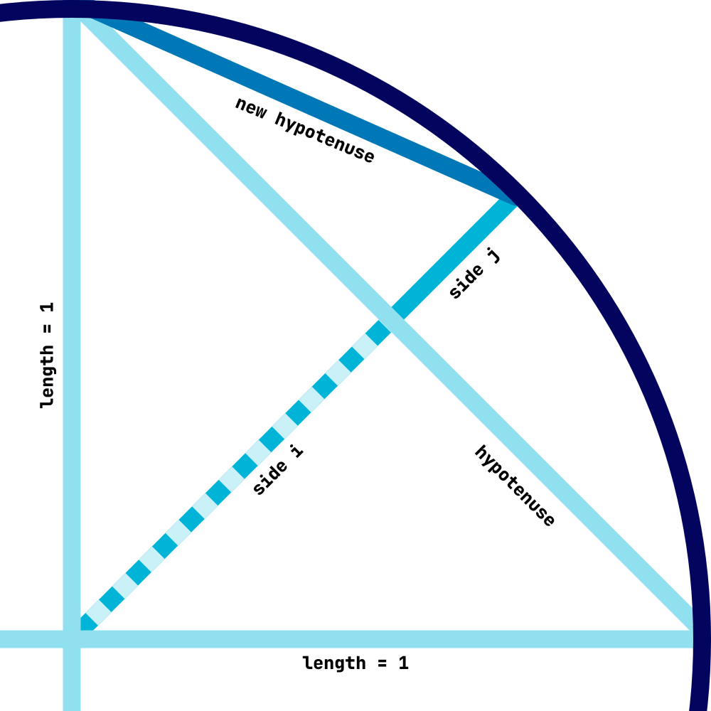

# PI PY

## Introduction

I use Archimedes algorithm to approximate PI.
I got the idea from Veritasium's video on ["The discovery that changed pi"](https://www.youtube.com/watch?v=gMlf1ELvRzc).

In it Dereck talks about the old intuitive algorithm, where you would subdivide the circle into finer and finer polygons, and apply Pythagoras' theorem to approximate PI.

I implemented it without looking at any code or algorithm online, just for fun. It gives pretty good approximations instantly, though you probably can't use it to get billions of digits of PI.

Here are the 100 first digits after 1k iterations (executed instantly): 
```txt
3.141592653589793238462643383279502884197169399375105820974944592307816406286208998628034825342117065
```
All the digits but the last seem to be correct.

## Mathematics

Here is a quick schema to understand the algorithm:



As you can see we draw a circle of radius 1, and its two axis. Let's focus on 1/4 of the circumference.

The idea is that if we take the hypotenuse of the axis, then it's an approximation of the length of the arc. And so if we multiply it by 4, we get an approximation of the circumference of the circle.

Of course it's a terrible approximation at first ! So to get a better result, we compute half of that hypotenuse, and then apply Pythagoras' theorem to get side i. Because the radius is 1, we can then easily find j. Finally, we apply Pythagoras' theorem again to get the new hypotenuse.

This new hypotenuse now represent only 1/8 of the circle, so we multiply it by 8 to get a better approximation of TAU.

At each iteration, we double the number of sides in our polygon, and get better and better approximations.
